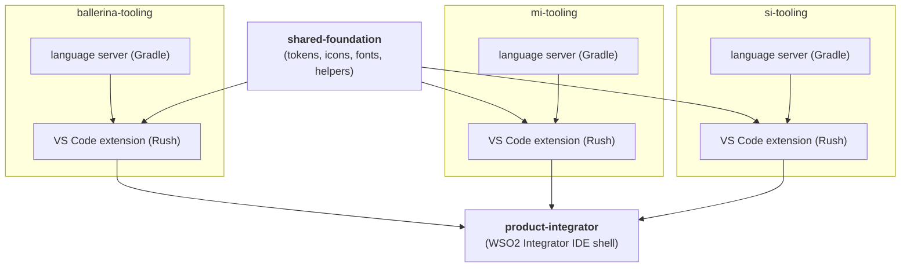

# WSO2 Integrator — CI/CD & Processes Proposal

---

## 1. Context & Scope

The WSO2 Integrator tooling is transitioning from a fragmented multi-repo layout to a clear three-layer structure. This proposal defines the branching, CI/CD, testing, versioning, and release processes for that new structure.

### Repository layout

| Layer | Repo(s) | Owns |
|---|---|---|
| **Product repos** | `ballerina-tooling`, `mi-tooling`, `si-tooling` | VS Code extension, welcome page, project creation, product workflows, language server |
| **Shared foundation** | `wso2/vscode-extensions` (transitional name) | Design tokens, icons, fonts, stable helpers/contracts |
| **Product shell** | `product-integrator` | Customised VS Code fork, global config, runtime management, bundling of all extensions |

**What this proposal covers:** branching model, GitHub Actions pipeline design, testing stages, quality/security gates, SemVer versioning automation, and the Nightly/Insider vs. Stable/GA release process.

**What this proposal does not cover:** internal code architecture, runtime behaviour, or the mechanics of the VS Code fork.

---

## 2. Repository Dependency & Build Order

### Diagram



### Build-order constraints

1. **Shared foundation first.** All product-repo extensions consume published packages from the shared foundation. A breaking change in the foundation must be released (or consumed as a pre-release) before dependent extension builds can succeed.

2. **Language server before extension (within a product repo).** Each extension bundles its own language server. The Gradle language-server build must complete and produce an artifact before the Rush extension build packages it.

3. **Extensions before product-integrator.** The `product-integrator` bundling job consumes a specific published version (or local build artifact) of each extension. It does not build extensions from source — it declares them as versioned dependencies. This decouples shell releases from product-repo CI and avoids transitive source coupling.

**Practical implication for CI:** each repo's pipeline is self-contained. Cross-repo dependencies are satisfied by versioned artifact references (npm package / VSIX file / Maven artifact), not by triggering upstream pipelines.

---

## 3. Branching Strategy

### Options

| Model | How it works | Pros | Cons |
|---|---|---|---|
| **GitHub Flow with maintenance branch** *(preferred)* | Feature branches off `main`; one `<major>.<minor>.x` patch branch maintained for the current stable release | Clear separation of ongoing work and patch fixes; agent-friendly | Minor additional branch management compared to pure GitHub Flow |
| Trunk-Based Development | Commit directly (or via very short branches) to `main` | Maximum simplicity, fastest integration | Higher risk without a strict feature-flag culture; harder with less experienced contributors |
| GitFlow | Parallel `main` / `develop` + release branches | Well-established for scheduled releases | Heavy branch management across 5 repos; context switching punishes agentic development |

### Recommendation: GitHub Flow with maintenance branch

- **`main`** — ongoing feature development targeting the next minor (or major) release. Always in a releasable state.
- **`<major>.<minor>.x`** (e.g. `1.4.x`) — a single maintenance branch cut from `main` at each GA release. Only patch fixes are backported here; no new features.
- Work happens on short-lived feature branches off `main` (`feat/`, `fix/`, `chore/` prefixes).
- When a new minor GA is released, the previous `<major>.<minor>.x` branch is retired and a new one is cut from the new GA tag.

---

## 4. CI/CD Pipeline Design

**Platform:** GitHub Actions. **Build tools:** Gradle (language servers), Rush (TS extensions).

### PR pipeline (blocks merge)

```
┌─────────────────────────────────────────────────────────────────┐
│  On: pull_request → main                                        │
├─────────────────────────────────────────────────────────────────┤
│  1. Compile          (Gradle / Rush build)                      │
│  2. Unit tests       (blocking)                                 │
│  3. Integration tests(blocking)                                 │
│  4. Quality gate     (SonarQube or GHAS — see Section 6)        │
│  5. Dependency scan  (Mend / GHAS — see Section 6)              │
└─────────────────────────────────────────────────────────────────┘
```

### Merge-to-main pipeline (nightly candidate)

```
┌─────────────────────────────────────────────────────────────────┐
│  On: push → main                                                │
├─────────────────────────────────────────────────────────────────┤
│  1. All PR steps (re-run on merge commit)                       │
│  2. Build & package artifact (VSIX / JAR)                       │
│  3. Publish to Nightly/Insider channel (see Section 8)          │
│  4. Trigger E2E tests (non-blocking on this run, reported async)│
└─────────────────────────────────────────────────────────────────┘
```

### Cross-repo coordination

Product repos publish versioned VSIX/package artifacts to a GitHub Packages registry on each merge to `main`. The `product-integrator` bundling pipeline declares explicit dependency versions and is triggered separately — it does not auto-follow upstream `main` commits. This prevents a product-repo commit from inadvertently breaking the IDE build.

---

## 5. Testing Strategy

| Test type | Runs in | Blocks merge? | Notes |
|---|---|---|---|
| Unit tests | PR pipeline + merge-to-main | **Yes** | Must pass before any artifact is published |
| Integration tests | PR pipeline + merge-to-main | **Yes** | Tests extension ↔ language server contract |
| Tooling / UI E2E tests | Nightly schedule + manual trigger | **No** (reported async) | Requires a full runtime environment; too slow for PR feedback loop |
| Backward compatibility tests | Release pipeline (Stable/GA) | **Yes** | Run against the previous GA release artifact before a new GA ships |

**E2E on PR (optional):** a label `run-e2e` on a PR triggers E2E as advisory feedback without blocking merge. Useful for high-risk changes.

---

## 6. Quality & Security Gates

### Options

| Tool | Category | Integration effort | Cost model |
|---|---|---|---|
| **GitHub Advanced Security (GHAS)** *(preferred)* | Code scanning (CodeQL) + secret scanning + dependency review | Native to GitHub, zero config for public repos | Included with GitHub Enterprise / billed per committer |
| SonarQube Cloud | Code quality + coverage gate | Requires SonarQube project setup per repo | Free tier available; paid for private repos at scale |
| Mend (WhiteSource) | SCA / dependency vulnerability scanning | GitHub Action + Mend account | Commercial |
| Veracode | SAST + SCA | Separate scan submission, longer feedback loop | Commercial |

### Recommendation: GHAS + SonarQube Cloud

- **GHAS** for secret scanning, dependency review (in PR), and CodeQL static analysis — covers security posture with near-zero pipeline overhead.
- **SonarQube Cloud** (free tier to start) for code quality gates (coverage thresholds, duplication, complexity) — gives actionable PR feedback on quality regressions.
- Revisit Mend or Veracode if compliance requirements surface later.

Both tools integrate as GitHub Actions steps and post results directly to the PR, fitting the PR pipeline in Section 4.

---

## 7. Versioning Strategy

All repos follow **Semantic Versioning (SemVer)**. Version bumps in manifests (`package.json`, `pom.xml`) are updated manually as part of the release workflow, with automated version increment scripts invoked by the release pipeline to reduce human error.

### Language server versioning

Language servers are versioned and released together with their parent extension — there is no independent language server release. Each product version (e.g. `ballerina-tooling@1.4.0`) includes a specific language server build; users always get a tested, matched pair. If an external consumer of a language server emerges in the future, the repo structure supports promoting it to an independent release without structural change.

---

## 8. Release Pipelines & Channels

### Two-track model

```
main branch
    │
    ├──► Nightly build (automated, on every merge to main)
    │         └─► Publish to "Insider" VS Code Marketplace channel
    │             Bundled into WSO2 Integrator IDE Insider build
    │             Published to GitHub Releases as a pre-release tag
    │
    └──► Stable/GA release (via release workflow + approval gate)
              └─► Publish to VS Code Marketplace (stable channel)
                  Bundled into WSO2 Integrator IDE Stable build
                  Published to https://github.com/wso2/product-integrator/releases
```

### Nightly / Insider channel

- Triggered by every merge to `main` in any product repo.
- Versions are suffixed: `1.2.0-nightly.20250609`.
- Published automatically with no approval gate.
- Serves as a preview channel for early adopters and QA.

### Stable / GA channel

- Triggered by a manually dispatched release workflow targeting a specific commit on `main` or the `<major>.<minor>.x` maintenance branch.
- Publishes clean SemVer tags (`1.2.0`).
- Requires an approval gate before the VS Code Marketplace publish step (see Section 9).
- The `product-integrator` GA bundle is published to [GitHub Releases](https://github.com/wso2/product-integrator/releases) as the final step.

### Artifact publishing targets

| Artifact | Nightly channel | Stable channel |
|---|---|---|
| VS Code extensions (×3 products) | VS Code Marketplace (pre-release) | VS Code Marketplace (stable) |
| WSO2 Integrator IDE | GitHub Releases (pre-release tag) | GitHub Releases (stable tag) |

---

## 9. Approval & Promotion Gates

- **Nightly:** fully automated — no approval needed. Speed and frequency are the point.
- **GA:** a GitHub Actions [Environment](https://docs.github.com/en/actions/deployment/targeting-different-environments) named `production` is configured with required reviewers (1–2 people). The publish step targets this environment, pausing until a reviewer approves in the GitHub UI. This is a one-click approval, not a lengthy process, but it ensures a human signs off before every public stable release.
