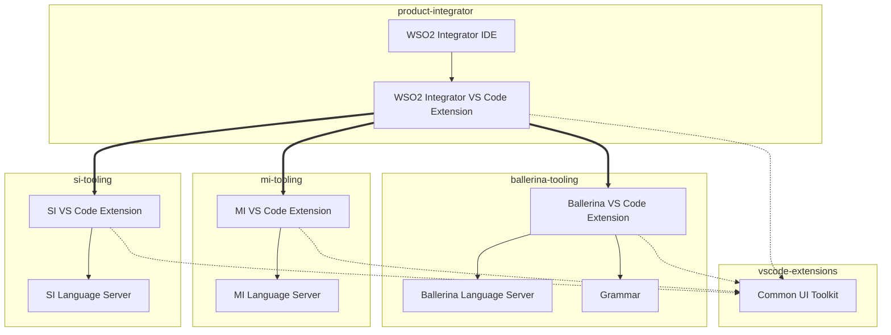

# Component Architecture

_Authors_: @NipunaRanasinghe \
_Reviewers_: \
_Created_: 2026/06/09 \
_Updated_: 2026/06/12

This document defines the component architecture of the WSO2 Integrator tooling — the main components, their responsibilities, and their dependencies. It serves as a reference for understanding the repo structure, the build process, and the impact of changes across repos.

## Component Overview

The WSO2 Integrator tooling is organized into three layers, each represented by one or more GitHub repositories. The layers are designed to separate concerns, promote reuse, and manage dependencies effectively.

| Layer | Repo(s) | Description |
|---|---|---|
| **Shared UI toolkit** | [vscode-extensions](https://github.com/wso2/vscode-extensions) | Shared UI components and utilities |
| **Product tooling** | [ballerina-tooling](https://github.com/wso2/ballerina-vscode/), [mi-tooling](https://github.com/wso2/mi-vscode), [si-tooling](https://github.com/siddhi-io/siddhi-plugin-vscode/) | Product-specific tooling components |
| **Product distribution** | [product-integrator](https://github.com/wso2/product-integrator/) | Distribution packages for the integrated tooling |

Each repo contains one or more components. A component is a cohesive set of functionality with a well-defined responsibility and clear boundaries. The table below lists the main components in each repo, along with a brief description of their responsibilities.

| Repo | Component | Description |
|---|---|---|
| [vscode-extensions](https://github.com/wso2/vscode-extensions) | **Common UI Toolkit** | Shared TypeScript libraries: UI components, fonts and icons, AI utilities, UI test utilities, and platform core. Consumed by all product extensions via a git submodule; built from source in each consumer workspace. |
| [ballerina-tooling](https://github.com/wso2/ballerina-vscode/) | **Ballerina Language Server** | JVM service (Gradle) that provides language intelligence — completions, diagnostics, hover, and similar — for Ballerina source files. Bundled into the Ballerina VS Code Extension at build time. |
| | **Grammar** | TextMate grammar for Ballerina syntax highlighting. Ballerina maintains its own grammar because it is a custom language with no upstream grammar. Bundled into the Ballerina VS Code Extension. |
| | **Ballerina VS Code Extension** | TypeScript/Rush project that packages the language server, grammar, and UI toolkit into a VSIX artifact. |
| [mi-tooling](https://github.com/wso2/mi-vscode) | **MI Language Server** | JVM service (Gradle) providing language intelligence for Micro Integrator XML configurations. Bundled into the MI VS Code Extension. |
| | **MI VS Code Extension** | TypeScript/Rush project that packages the MI language server and UI toolkit into a VSIX artifact. |
| [si-tooling](https://github.com/siddhi-io/siddhi-plugin-vscode/) | **SI Language Server** | JVM service (Gradle) providing language intelligence for Siddhi streaming queries. Bundled into the SI VS Code Extension. |
| | **SI VS Code Extension** | TypeScript/Rush project that packages the SI language server and UI toolkit into a VSIX artifact. |
| [product-integrator](https://github.com/wso2/product-integrator/) | **WSO2 Integrator VS Code Extension** | Aggregates the three product VS Code extensions as versioned dependencies. Published to VS Code Marketplace. |
| | **WSO2 Integrator IDE** | Bundles the WSO2 Integrator VS Code Extension into a standalone IDE distribution. Published to GitHub Releases. |

## Dependency Diagram

The diagram below shows the build-time dependencies between components across the repos.

An arrow from A to B means A depends on B. The arrow style indicates the dependency type:

- **Thick arrow** — A declares B as a versioned dependency (e.g. the WSO2 Integrator VS Code Extension consuming the product extensions)
- **Solid arrow** — A bundles B into its artifact (e.g. a VS Code extension bundles its language server)
- **Dashed arrow** — A builds B from source via a git submodule (the shared UI toolkit packages)

## Build Implications

The dependency relationships above determine the build order: each product tooling repo must produce its VSIX artifact before `product-integrator` can assemble the final distribution. Within each product tooling repo, two things must happen first:

1. **Shared UI toolkit built from source.** Each consumer repo includes `vscode-extensions` as a git submodule. The toolkit packages are built from source inside the consumer workspace before any extension package that depends on them. There is no independent toolkit release — to adopt toolkit changes, consumers move their submodule pointer forward and rebuild.

2. **Language server built before extension packaging.** Each tooling repo builds its language server (Gradle) first, producing a JAR. The VS Code extension then packages that JAR into the VSIX artifact.

Once each product tooling repo has produced its VSIX:

3. **`product-integrator` consumes pinned extension versions.** The `product-integrator` repo does not build the product extensions from source. All the product extensions are consumed as versioned dependencies and tracked in a version properties file. The WSO2 Integrator IDE in turn bundles the WSO2 Integrator VS Code Extension. This keeps the product distribution decoupled from product-repo CI.
