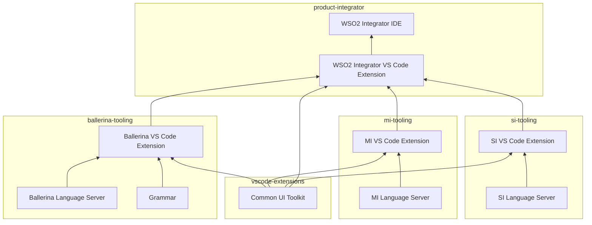

# Component Architecture

_Authors_: @NipunaRanasinghe \
_Reviewers_: \
_Created_: 2026/06/09 \
_Updated_: 2026/06/12

This document defines the component layout, dependency relationships, and build order across the WSO2 Integrator tooling repos.

## Repository Layout

| Layer | Repo(s) | Owns |
|---|---|---|
| **Shared UI toolkit** | [`vscode-extensions`](https://github.com/wso2/vscode-extensions) | Only the shared libraries consumed via the git submodule: (UI components, fonts and icons, AI utilities, UI test utilities, and platform core) |
| **Product tooling** | [`ballerina-tooling`](https://github.com/wso2/ballerina-vscode/), [`mi-tooling`](https://github.com/wso2/mi-vscode), [`si-tooling`](https://github.com/siddhi-io/siddhi-plugin-vscode/) | VS Code extensions, language servers, and product-specific components |
| **Product distribution** | [`product-integrator`](https://github.com/wso2/product-integrator/) | WSO2 Integrator VS Code Extension + WSO2 Integrator IDE |

> **Note:** This document describes the _target_ architecture. Repositories are currently in various states of migration toward this layout, and some cross-repo dependencies are not yet aligned with it. The goal is to converge on this architecture across all repos.

## Dependency Diagram

The diagram below shows the build-time dependencies between components across the repos.

An arrow from A to B means A depends on B, either by:
- declaring as a versioned dependency (e.g. product extensions consumed by the WSO2 Integrator VS Code Extension)
- bundling into its artifact (e.g. a language server into its parent extension),
- building from source via a git submodule (the shared UI toolkit packages)

## Build Order

Builds _must_ respect the following dependency order.

1. **Shared UI toolkit.** Each consumer repo includes `vscode-extensions` as a git submodule and builds the toolkit packages from source as part of its own workspace. There is no independent toolkit release — adopting toolkit changes means updating the submodule pointer (see [Cross-Repo Version Bumps](03-versioning-strategy.md#cross-repo-version-bumps)).

2. **Language server before extension.** Each VS Code extension bundles its own language server. The Gradle build _must_ produce an artifact before the Rush build can package it.

3. **Product extensions before `product-integrator`.** The WSO2 Integrator VS Code Extension declares each product extension as a versioned dependency — it does not build them from source. The WSO2 Integrator IDE in turn bundles the WSO2 Integrator VS Code Extension. This keeps the product distribution decoupled from product-repo CI.
