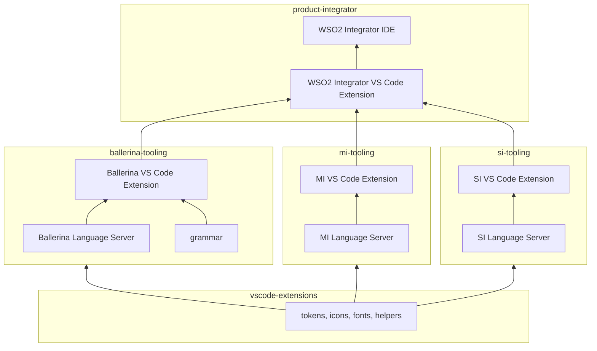

# Component Architecture

_Authors_: @NipunaRanasinghe \
_Reviewers_: \
_Created_: 2026/06/09 \
_Updated_: 2026/06/10

This document defines the component ownership, dependency relationships, and build order across the WSO2 Integrator tooling repos.

## Repository Layout

| Layer | Repo(s) | Owns |
|---|---|---|
| **Shared foundation** | [`vscode-extensions`](https://github.com/wso2/vscode-extensions) | Design tokens, icons, fonts, stable helpers/contracts |
| **Product repos** | [`ballerina-tooling`](https://github.com/wso2/ballerina-vscode/), [`mi-tooling`](https://github.com/wso2/mi-vscode), [`si-tooling`](https://github.com/siddhi-io/siddhi-plugin-vscode/) | VS Code extension, welcome page, project creation, product workflows, language server, grammar (`ballerina-tooling` only) |
| **Product shell** | [`product-integrator`](https://github.com/wso2/product-integrator/) | WSO2 Integrator VS Code Extension (orchestrating VS Code plugin) + WSO2 Integrator IDE (customised VS Code fork, global config, runtime management) |

## Dependency Diagram

## Build Order

Builds _must_ respect the following dependency order.

1. **Shared foundation.** Product-repo extensions consume published packages from `vscode-extensions`. A breaking change in the shared foundation _must_ be released before any dependent extension build can proceed.

2. **Language server before extension.** Each VS Code extension bundles its own language server. The Gradle build _must_ produce an artifact before the Rush build can package it.

3. **Product extensions before `product-integrator`.** The WSO2 Integrator VS Code Extension declares each product extension as a versioned dependency — it does not build them from source. The WSO2 Integrator IDE in turn bundles the WSO2 Integrator VS Code Extension. This keeps the product shell decoupled from product-repo CI.

> **Note:** Each repo's pipeline is self-contained. Cross-repo dependencies are resolved through versioned artifact references (`npm` package, VSIX, or Maven artifact) — not by triggering upstream pipelines.
