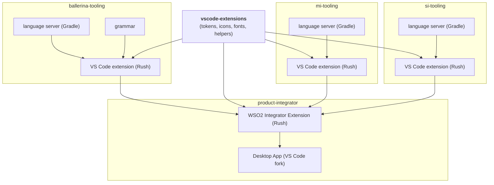

# Repository Structure & Build Order

_Authors_: @NipunaRanasinghe \
_Reviewers_: \
_Created_: 2026/06/09 \
_Updated_: 2026/06/10

This document describes the three-layer repository structure of the WSO2 Integrator tooling revamp, the dependency relationships between repos, and the build-order constraints the CI/CD pipelines _must_ respect.

## Repository Layout

The WSO2 Integrator tooling is transitioning from a fragmented multi-repo layout to a clear three-layer structure.

| Layer | Repo(s) | Owns |
|---|---|---|
| **Shared foundation** | `wso2/vscode-extensions` | Design tokens, icons, fonts, stable helpers/contracts |
| **Product repos** | `ballerina-tooling`, `mi-tooling`, `si-tooling` | VS Code extension, welcome page, project creation, product workflows, language server, grammar (`ballerina-tooling` only) |
| **Product shell** | `product-integrator` | WSO2 Integrator Extension (orchestrating VS Code plugin) + Desktop App (customised VS Code fork, global config, runtime management) |

## Dependency Diagram

## Build-Order Constraints

1. **Shared foundation first.** All product-repo extensions consume published packages from the shared foundation. A breaking change in the foundation _must_ be released (or consumed as a pre-release) before dependent extension builds can succeed.

2. **Language server before extension (within a product repo).** Each extension bundles its own language server. The Gradle language-server build _must_ complete and produce an artifact before the Rush extension build packages it.

3. **Extensions before product-integrator.** The WSO2 Integrator Extension in `product-integrator` consumes a specific published version (or local build artifact) of each product extension. It does not build them from source — it declares them as versioned dependencies. The Desktop App in turn bundles the WSO2 Integrator Extension. This decouples shell releases from product-repo CI and avoids transitive source coupling.

> **Note:** Each repo's pipeline is self-contained. Cross-repo dependencies are satisfied by versioned artifact references (npm package / VSIX file / Maven artifact), not by triggering upstream pipelines.

## Scope

**Covered by this proposal:** branching model, GitHub Actions pipeline design, testing stages, quality/security gates, SemVer versioning, and the Nightly/Insider vs. Stable/GA release process.

**Not covered:** internal code architecture, runtime behaviour, or the mechanics of the VS Code fork.
