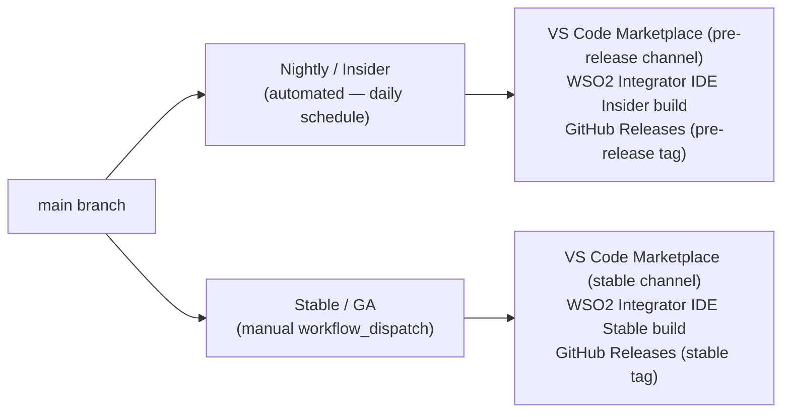

# CI/CD Pipelines

_Authors_: @NipunaRanasinghe \
_Reviewers_: \
_Created_: 2026/06/09 \
_Updated_: 2026/06/12

This document describes the GitHub Actions pipeline structure for pull requests and releases across all repos.

- **CI/CD platform:** GitHub Actions
- **Build tools:** Gradle (language servers), Rush (TypeScript extensions)

## PR Pipeline

The PR pipeline runs on every `pull_request` targeting `main` and _must_ pass before any merge is permitted.

The quality gate and dependency scan steps are described in [Quality & Security Gates](06-quality-and-security-gates.md).

## Cross-Repo Coordination

Product repos publish versioned VSIX artifacts via their release pipelines. The `product-integrator` bundling pipeline declares explicit dependency versions and is triggered separately — it is not triggered automatically by upstream releases. This prevents an upstream release from inadvertently breaking the IDE build.

## Release Pipelines

All release pipelines run on GitHub Actions. There are two tracks.

### Nightly / Insider Pipeline

- Triggered automatically on a daily schedule.
- Version suffix: `1.2.0-nightly.20260609`.
- Fully automated — no approval gate.

### Stable / GA Pipeline

- Triggered by a manually dispatched `workflow_dispatch` targeting a specific commit on `main` or the `<major>.<minor>.x` maintenance branch.
- Publishes SemVer tags without pre-release suffixes (e.g. `1.2.0`).
- The publish step targets a GitHub Actions [Environment](https://docs.github.com/en/actions/deployment/targeting-different-environments) named `production`, configured with 1–2 required reviewers. The workflow pauses here until a reviewer approves in the GitHub UI.

### Artifact Publishing Targets

| Artifact | Nightly | Stable |
|---|---|---|
| VS Code extensions (×4) | VS Code Marketplace (pre-release) | VS Code Marketplace (stable) |
| WSO2 Integrator IDE | GitHub Releases (pre-release tag) | GitHub Releases (stable tag) |

## Pending Items

The following items represent gaps between this proposal and the current state of the repos.

- **No automated Nightly/Insider publish.** The automated nightly publishing track does not exist. Merges to `main` do not trigger a publish in any repo.
- **Trivy not configured in `product-integrator` and `si-tooling` PR pipelines.** The dependency scan step is missing from both repos and needs to be added.
- **No `production` Environment approval gate.** No GitHub Actions Environment with required reviewers is configured in any repo. The approval gate for the Stable/GA pipeline needs to be set up in each repo.
- **SonarQube Cloud not configured.** No repo has SonarQube integrated. See [Quality & Security Gates](06-quality-and-security-gates.md) for the full implementation plan.
