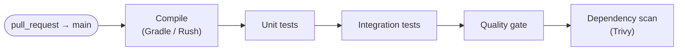
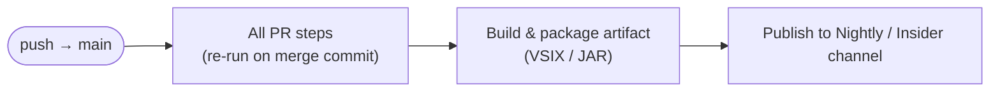
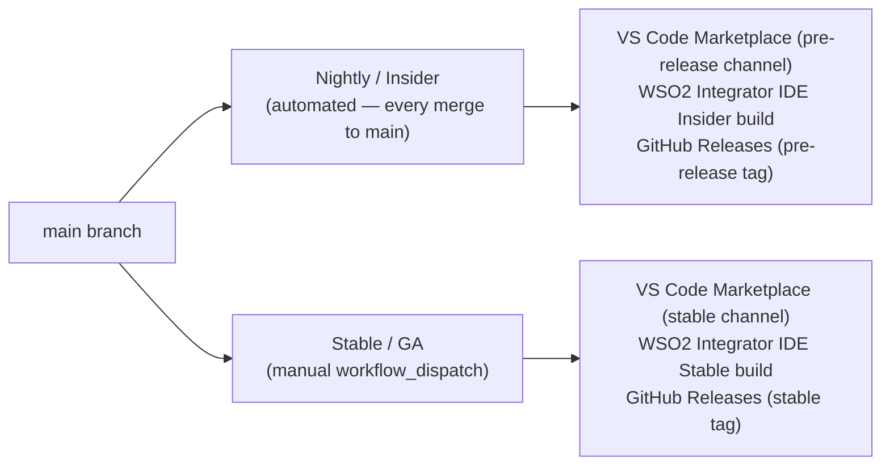

# CI/CD Pipelines

_Authors_: @NipunaRanasinghe \
_Reviewers_: \
_Created_: 2026/06/09 \
_Updated_: 2026/06/11

This document describes the GitHub Actions pipeline anatomy for pull requests and merges to `main` across all repos.

**Platform:** GitHub Actions. **Build tools:** Gradle (language servers), Rush (TS extensions).

## PR Pipeline

The PR pipeline runs on every `pull_request` targeting `main` and _must_ pass before any merge is permitted.

The quality gate and dependency scan steps are described in [Quality & Security Gates](06-quality-and-security-gates.md).

## Merge-to-Main Pipeline

The merge-to-main pipeline runs on every push to `main` and produces the nightly candidate artifact.

The publish step feeds the Nightly / Insider release track (see [Release Pipelines](#release-pipelines)).

## Cross-Repo Coordination

Product repos publish versioned VSIX/package artifacts to a GitHub Packages registry on each merge to `main`. The `product-integrator` bundling pipeline declares explicit dependency versions and is triggered separately — it does not auto-follow upstream `main` commits. This prevents a product-repo commit from inadvertently breaking the IDE build.

## Release Pipelines

All release pipelines run on GitHub Actions. There are two tracks.

### Nightly / Insider Pipeline

- Triggered automatically on every merge to `main`.
- Version suffix: `1.2.0-nightly.20260609`.
- Fully automated — no approval gate.

### Stable / GA Pipeline

- Triggered by a manually dispatched `workflow_dispatch` targeting a specific commit on `main` or the `<major>.<minor>.x` maintenance branch.
- Publishes clean SemVer tags (e.g. `1.2.0`).
- The publish step targets a GitHub Actions [Environment](https://docs.github.com/en/actions/deployment/targeting-different-environments) named `production`, configured with 1–2 required reviewers. The workflow pauses here until a reviewer approves in the GitHub UI.

### Artifact Publishing Targets

| Artifact | Nightly | Stable |
|---|---|---|
| VS Code extensions (×4) | VS Code Marketplace (pre-release) | VS Code Marketplace (stable) |
| WSO2 Integrator IDE | GitHub Releases (pre-release tag) | GitHub Releases (stable tag) |
