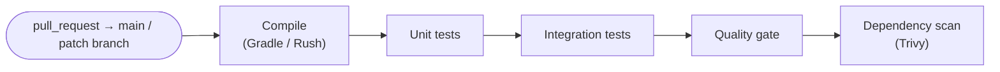
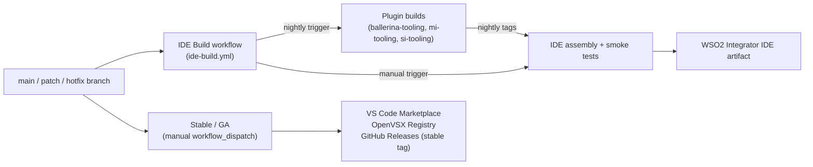

# CI/CD Pipelines

_Authors_: @NipunaRanasinghe \
_Reviewers_: \
_Created_: 2026/06/09 \
_Updated_: 2026/06/15

This document describes the GitHub Actions pipeline structure for pull requests and releases across all repos.

- **CI/CD platform:** GitHub Actions
- **Build tools:** Gradle (language servers), Rush (TypeScript extensions)

## Pull Request Pipelines

PR pipelines run on every non-draft pull request targeting active branches (main + patch branches) and _must_ pass before any merge is permitted.

The quality gate and dependency scan steps are described in [Quality & Security Gates](06-quality-and-security-gates.md).

## Release Pipelines

All release pipelines run on GitHub Actions. Product repos publish versioned VSIX artifacts independently; the `product-integrator` bundling pipeline pins explicit dependency versions and is triggered separately, not automatically by upstream releases. There are three tracks.

### Nightly Pipeline

The nightly pipeline runs as the scheduled mode of `ide-build.yml` in `product-integrator`, triggered at midnight UTC. It owns the full sequence.

**Stage 1 — Plugin builds (parallel).** `ide-build.yml` triggers the nightly build workflow in each of the three plugin repos (`ballerina-tooling`, `mi-tooling`, `si-tooling`) via the GitHub API, then polls until all three complete. Each plugin runs its full build and test suite including plugin-level E2E tests, and on success uploads its VSIX to a `nightly` pre-release tag on its own GitHub Releases. If any plugin build fails, the workflow exits with an error and Stage 2 does not run.

**Stage 2 — IDE assembly.** Once all three plugin builds succeed, `ide-build.yml` downloads the VSIX from each plugin's `nightly` tag, builds the IDE for Linux, macOS, and Windows, runs smoke tests and product-level E2E, and stores the nightly IDE artifact on the workflow run.

Cross-repo triggering requires a GitHub App or a scoped PAT with `actions:write` permission on each plugin repo.

### IDE Build Workflow

`ide-build.yml` is the single workflow that builds the full WSO2 Integrator IDE from the upstream layers. It has two triggers:

- **Schedule (midnight UTC) — nightly mode:** runs Stage 1 then Stage 2 as described in [Nightly Pipeline](#nightly-pipeline) above.
- **`workflow_dispatch` — on-demand mode:** skips Stage 1; the release manager provides an explicit version (or `nightly`) for each plugin as an input. The workflow downloads those artifacts directly and runs Stage 2.

On-demand mode is used to produce pre-releases, on-demand testing packs, or to verify a specific combination of plugin versions before a stable release.

### Stable / GA Pipeline

The stable release runs as two separate `workflow_dispatch` workflows per repo.

1. **`release-vsix.yml`:** builds the VSIX, creates a draft GitHub Release, and opens a version-bump PR. Takes `isPreRelease` (boolean), `version` (patch / minor / major), and `lsSource` (build from source or download from a release tag) as inputs. The `isPreRelease` flag controls which Marketplace channel is targeted.
2. **`publish-vsix.yml`:** downloads the VSIX artifact produced by a specific `release-vsix.yml` run (referenced by run ID) and publishes it to the VS Code Marketplace and OpenVSX Registry.

The `product-integrator` release runs `build-and-release.yml`, which builds installers for Linux, macOS, and Windows, then runs smoke tests before publishing to GitHub Releases. The smoke test runs a `hello-world-service` end-to-end test as a blocking gate; an ICP test runs as advisory only.

### Artifact Publishing Targets

| Component | Nightly | Stable |
|---|---|---|
| Shared UI library | not released — built from source in consumers | not released |
| Language server | not released — bundled in its parent extension | not released |
| VS Code extensions (×4) | GitHub Releases (`nightly` tag per plugin) | VS Code Marketplace (stable) + OpenVSX Registry |
| WSO2 Integrator IDE | Workflow artifact (nightly build run) | GitHub Releases (stable tag) |

## Pending Items

The following items represent gaps between this proposal and the current state of the repos.

- **Implement the nightly pipeline.** `ide-build.yml` and the plugin `nightly` tag uploads described here do not yet exist. A GitHub App (or scoped PAT) with `actions:write` on each plugin repo is required for `ide-build.yml` to trigger cross-repo builds. Current state: `ballerina-tooling` and `mi-tooling` have scheduled daily builds that build and test only; `si-tooling` has no scheduled build at all.
- **Re-enable unit tests in the `ballerina-tooling` PR pipeline.** The `ExtTest_Ballerina` job has `if: false` pending test stability improvements. Unit tests do not currently run on PRs or daily builds in that repo.
- **Add tests, Trivy, and quality gates to the `product-integrator` PR pipeline.** The PR CI job currently builds the distribution without tests, Trivy, or quality gates.
- **Add Trivy to `si-tooling` and `product-integrator` PR pipelines.** The dependency scan step is missing from both repos.
- **Configure SonarQube Cloud in all repos.** No repo has SonarQube integrated. See [Quality & Security Gates](06-quality-and-security-gates.md) for the full implementation plan.
