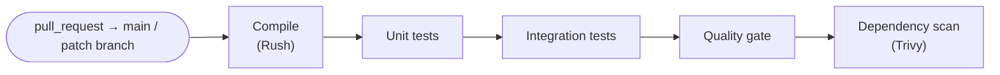
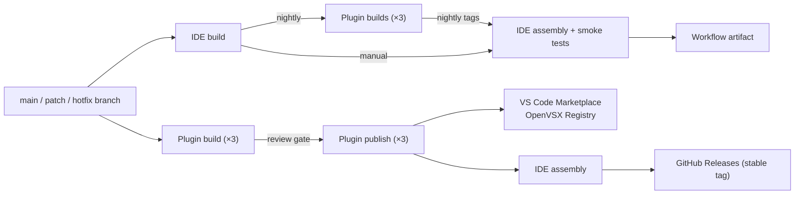

# CI/CD Pipelines

_Authors_: @NipunaRanasinghe \
_Reviewers_: \
_Created_: 2026/06/09 \
_Updated_: 2026/06/15

This document describes the GitHub Actions pipelines for pull requests and releases across all repos.

- **CI/CD platform:** GitHub Actions
- **Build tools:** Rush (TypeScript extensions), Gradle (language servers)

## Pull Request Pipelines

PR pipelines run on every non-draft pull request targeting active branches (main + patch branches) and _must_ pass before any merge is permitted.

The quality gate and dependency scan steps are described in [Quality & Security Gates](quality-and-security-gates.md).

## Release Pipelines

There are three release pipeline tracks: nightly, manual IDE build, and stable/GA.

### Nightly Pipeline

**Stage 1 — Plugin builds (parallel).** The IDE build workflow triggers the nightly build workflow in each of the three plugin repos (`ballerina-tooling`, `mi-tooling`, `si-tooling`) via the GitHub API and waits for all three to complete. Each plugin runs its full build and test suite, and on success uploads its VSIX to a `nightly` pre-release tag on its own GitHub Releases. If any plugin build fails, Stage 2 does not run.

**Stage 2 — IDE assembly.** Once all three plugin builds succeed, the IDE build workflow downloads the VSIX from each plugin's `nightly` tag, builds the IDE for Linux, macOS, and Windows, runs smoke tests, and stores the nightly IDE artifact on the workflow run.

### Manual IDE Build Pipeline

The IDE build workflow can also be triggered manually via `workflow_dispatch`. In this mode, Stage 1 is skipped — the release manager provides an explicit version (or `nightly`) for each plugin as an input, and the workflow downloads those artifacts directly and runs Stage 2.

This is used for pre-release builds (alpha, beta, RC) and for verifying a specific combination of plugin versions before a stable release.

### Stable / GA Pipeline

The stable release runs as manual `workflow_dispatch` workflows, with an explicit review gate between build and publish.

**Stage 1 — Plugin build.** The release manager triggers the plugin build workflow in each plugin repo (`ballerina-tooling`, `mi-tooling`, `si-tooling`). The workflow builds the VSIX and creates a draft GitHub Release. The `isPreRelease` input (boolean) controls which Marketplace channel is targeted.

**Stage 2 — Plugin publish.** After reviewing the draft release, the release manager triggers the plugin publish workflow, referencing the run ID from Stage 1. The workflow publishes the VSIX to the VS Code Marketplace and OpenVSX Registry.

**Stage 3 — IDE assembly.** Once all plugin releases are published, the release manager triggers the IDE release workflow in `product-integrator`. The workflow builds installers for Linux, macOS, and Windows, runs smoke tests, and publishes to GitHub Releases only if smoke tests pass.

### Artifact Publishing Targets

| Component | Nightly | Manual | Stable |
|---|---|---|---|
| Shared UI library | N/A (built from source via git submodules) | N/A (built from source via git submodules) | N/A (built from source via git submodules) |
| Language server | N/A (bundled in parent extension) | N/A (bundled in parent extension) | N/A (bundled in parent extension) |
| VS Code extensions (×4) | GitHub Releases (`nightly` tag per plugin) | N/A (Stage 1 skipped) | VS Code Marketplace (stable) + OpenVSX Registry |
| WSO2 Integrator IDE | Workflow artifact (nightly build run) | Workflow artifact (manual build run) | GitHub Releases (stable tag) |

## Pending Items

The following items represent gaps between this proposal and the current state of the repos.

- **Implement the nightly pipeline.** `ide-build.yml` and the plugin `nightly` tag uploads described here do not yet exist. A GitHub App (or scoped PAT) with `actions:write` on each plugin repo is required for `ide-build.yml` to trigger cross-repo builds. Current state: `ballerina-tooling` and `mi-tooling` have scheduled daily builds that build and test only; `si-tooling` has no scheduled build at all.
- **Re-enable unit tests in the `ballerina-tooling` PR pipeline.** The `ExtTest_Ballerina` job has `if: false` pending test stability improvements. Unit tests do not currently run on PRs or daily builds in that repo.
- **Add tests, Trivy, and quality gates to the `product-integrator` PR pipeline.** The PR CI job currently builds the distribution without tests, Trivy, or quality gates.
- **Add Trivy to `si-tooling` and `product-integrator` PR pipelines.** The dependency scan step is missing from both repos.
- **Configure SonarQube Cloud in all repos.** No repo has SonarQube integrated. See [Quality & Security Gates](quality-and-security-gates.md) for the full implementation plan.
