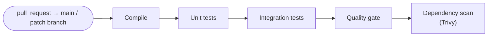
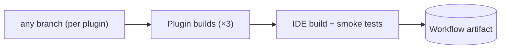
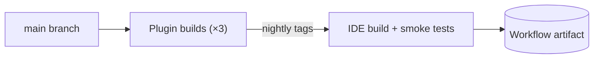
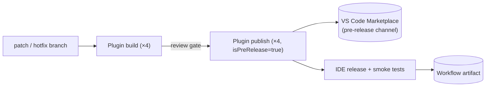
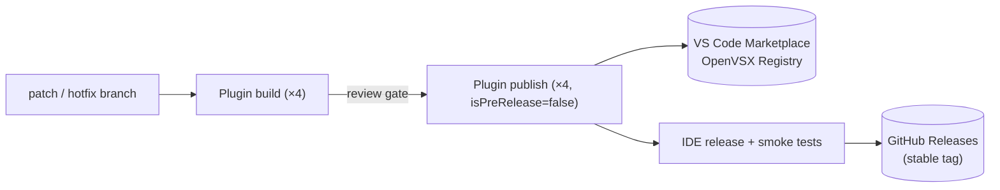

# CI/CD Pipelines

_Authors_: @NipunaRanasinghe \
_Reviewers_: \
_Created_: 2026/06/09 \
_Updated_: 2026/06/17

This document describes the four GitHub Actions pipeline types used across all WSO2 Integrator repos:

- **PR pipelines:** run on every pull request to active branches; all gates must pass before merge.
- **Custom IDE Build pipeline:** builds a complete IDE pack on demand from a specific set of plugin branches.
- **Nightly pipeline:** runs daily from `main` and produces a tested IDE build.
- **Stable / GA pipeline:** a single three-stage pipeline (plugin build → plugin publish → IDE release) for both pre-release and GA releases; the `isPreRelease` flag controls the Marketplace channel and IDE artifact destination.

## Pull Request Pipelines

PR pipelines run on every non-draft pull request targeting active branches (main + patch branches) and must pass before any merge is permitted.

The quality gate and dependency scan steps are described in [Quality & Security Gates](quality-and-security-gates.md).

## Custom IDE Build Pipeline

Triggered manually to build a complete IDE pack from a specific set of plugin branches for developer testing.

This workflow can be used to create a complete IDE pack from a specific set of plugin branches — for example, when testing a feature that spans multiple repos.

The workflow takes a branch name as an input for each of the three plugin repos and for `product-integrator` (defaulting to `main`). It triggers a build in each plugin repo from the specified branches, compiles the WSO2 Integrator extension from the specified `product-integrator` branch, builds the IDE for Linux, macOS, and Windows, and stores the result as a workflow artifact.

## Nightly Pipeline

Runs automatically on a daily schedule from `main`.

**Stage 1 — Plugin builds (parallel):** The nightly build workflow triggers the build workflow in each of the three plugin repos (`ballerina-tooling`, `mi-tooling`, `si-tooling`) via the GitHub API and waits for all three to complete. Each plugin runs its full build and test suite, and on success uploads its VSIX to a `nightly` pre-release tag on its own GitHub Releases. If any plugin build fails, Stage 2 does not run.

**Stage 2 — IDE build:** Once all three plugin builds succeed, the workflow downloads the VSIX from each plugin's `nightly` tag. The `product-integrator` build then compiles the WSO2 Integrator extension from source, assembles the IDE for Linux, macOS, and Windows, runs smoke tests, and stores the nightly IDE artifact on the workflow run.

## Release Pipelines

The Stable / GA pipeline runs all three stages for both pre-releases (alpha, beta, RC) and GA releases. The `isPreRelease` flag controls the Marketplace channel and the IDE artifact destination.

**Pre-release:**

**GA Release:**

**Stage 1 — Plugin build:** The release manager triggers the plugin build workflow in each of the four plugin repos (`ballerina-tooling`, `mi-tooling`, `si-tooling`, and the WSO2 Integrator extension in `product-integrator`), specifying the source branch as an input — the `<major>.<minor>.x` patch branch for feature and patch releases, or the hotfix branch for hotfixes. The workflow builds the VSIX and creates a draft GitHub Release. The draft artifact can be downloaded for internal verification (e.g. the fix author testing a hotfix locally) before Stage 2 publishes it.

**Stage 2 — Plugin publish:** After reviewing the draft release, the release manager triggers the plugin publish workflow, referencing the run ID from Stage 1. The `isPreRelease` flag controls where the VSIX is published:

- **Pre-release:** VS Code Marketplace pre-release channel
- **GA:** VS Code Marketplace stable channel + OpenVSX Registry

**Stage 3 — IDE release:** The release manager triggers the IDE release workflow in `product-integrator`. The workflow downloads the four published plugin VSIXs, builds installers for Linux, macOS, and Windows, and runs smoke tests. On pre-release builds, the IDE is stored as a workflow artifact; on GA builds, it is published to GitHub Releases only if smoke tests pass.

## Artifact Publishing Targets

| Component | Nightly | Custom Build | Pre-release | Stable/GA |
|---|---|---|---|---|
| Shared UI library | N/A (built from source via git submodules) | N/A (built from source via git submodules) | N/A (built from source via git submodules) | N/A (built from source via git submodules) |
| Language server | N/A (bundled in parent extension) | N/A (bundled in parent extension) | N/A (bundled in parent extension) | N/A (bundled in parent extension) |
| VS Code extension plugins (×3) | GitHub Releases (`nightly` tag per plugin) | N/A (built per run, not published) | VS Code Marketplace (pre-release channel) | VS Code Marketplace (stable) + OpenVSX Registry |
| WSO2 Integrator extension | Compiled during IDE build (no separate nightly tag) | N/A (built per run, not published) | VS Code Marketplace (pre-release channel) | VS Code Marketplace (stable) + OpenVSX Registry |
| WSO2 Integrator IDE | Workflow artifact (nightly build run) | Workflow artifact (custom build run) | Workflow artifact (IDE release) | GitHub Releases (stable tag) |

## Pending Items

The following items represent gaps between this proposal and the current state of the repos.

- **Implement VS Code Marketplace publishing for the WSO2 Integrator extension:** The WSO2 Integrator extension in `product-integrator` does not yet have the Stage 1 / Stage 2 pipeline workflows (plugin build → draft GitHub Release → publish to Marketplace) that the other three plugin repos have. These workflows need to be added to `product-integrator` before the extension can be independently published to the VS Code Marketplace.
- **Implement the nightly pipeline:** The nightly build workflow and the plugin `nightly` tag uploads described here do not yet exist. A GitHub App (or scoped PAT) with `actions:write` on each plugin repo is required to trigger cross-repo builds. Current state: `ballerina-tooling` and `mi-tooling` have scheduled daily builds that build and test only; `si-tooling` has no scheduled build at all.
- **Implement the custom IDE build pipeline:** The cross-repo custom IDE build workflow described here does not yet exist.
- **Re-enable unit tests in the `ballerina-tooling` PR pipeline:** The `ExtTest_Ballerina` job has `if: false` pending test stability improvements. Unit tests do not currently run on PRs or daily builds in that repo.
- **Add tests, Trivy, and quality gates to the `product-integrator` PR pipeline:** The PR CI job currently builds the distribution without tests, Trivy, or quality gates.
- **Add Trivy to `si-tooling` and `product-integrator` PR pipelines:** The dependency scan step is missing from both repos.
- **Configure SonarQube Cloud in all repos:** No repo has SonarQube integrated. See [Quality & Security Gates](quality-and-security-gates.md) for the full implementation plan.
