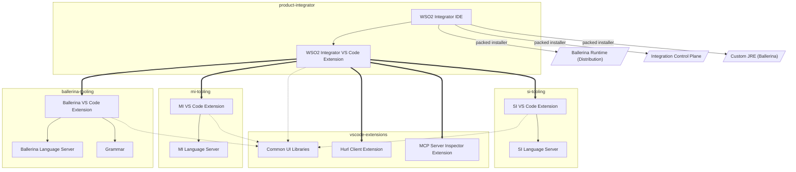

# Component Architecture

_Authors_: @NipunaRanasinghe \
_Reviewers_: \
_Created_: 2026/06/09 \
_Updated_: 2026/06/12

This document defines the component architecture of the WSO2 Integrator tooling: the main components, their responsibilities, and their dependencies. It serves as a reference for understanding the repo structure, the build process, and the impact of changes across repos.

## Component Overview

The WSO2 Integrator tooling is organized into three layers, each represented by one or more GitHub repositories. The layers are designed to separate concerns, promote reuse, and manage dependencies effectively.

| Layer | Repo(s) | Description |
|---|---|---|
| **Shared Libraries and Extensions** | [vscode-extensions](https://github.com/wso2/vscode-extensions) | Shared UI libraries consumed by all product tooling repos, and helper VS Code extensions consumed by the product distribution layer |
| **Product tooling** | [ballerina-tooling](https://github.com/wso2/ballerina-vscode/), [mi-tooling](https://github.com/wso2/mi-vscode), [si-tooling](https://github.com/siddhi-io/siddhi-plugin-vscode/) | Product-specific tooling components |
| **Product distribution** | [product-integrator](https://github.com/wso2/product-integrator/) | Distribution packages for the integrated tooling |

Each repo contains one or more components. A component is a cohesive set of functionality with a well-defined responsibility and clear boundaries. The table below lists the main components in each repo, along with a brief description of their responsibilities.

| Repo | Component | Description |
|---|---|---|
| [vscode-extensions](https://github.com/wso2/vscode-extensions) | **Common UI Libraries** | Shared TypeScript libraries: UI components, fonts and icons, AI utilities, UI test utilities, and platform core. Consumed by all product extensions via a git submodule; built from source in each consumer workspace. |
| | **Hurl Client Extension** | VS Code extension for Hurl client based try-it capability. Published independently and consumed by `product-integrator` as a versioned built-in extension. |
| | **MCP Server Inspector Extension** | VS Code extension for inspecting MCP servers. Published independently and consumed by `product-integrator` as a versioned built-in extension. |
| [ballerina-tooling](https://github.com/wso2/ballerina-vscode/) | **Ballerina Language Server** | JVM service (Gradle) that provides language intelligence (completions, diagnostics, hover, and similar) for Ballerina source files. Bundled into the Ballerina VS Code Extension at build time. |
| | **Grammar** | TextMate grammar for Ballerina syntax highlighting. Ballerina maintains its own grammar because it is a custom language with no upstream grammar. Bundled into the Ballerina VS Code Extension. |
| | **Ballerina VS Code Extension** | TypeScript/Rush project that packages the language server, grammar, and UI libraries into a VSIX artifact. |
| [mi-tooling](https://github.com/wso2/mi-vscode) | **MI Language Server** | JVM service (Gradle) providing language intelligence for Micro Integrator XML configurations. Bundled into the MI VS Code Extension. |
| | **MI VS Code Extension** | TypeScript/Rush project that packages the MI language server and UI libraries into a VSIX artifact. |
| [si-tooling](https://github.com/siddhi-io/siddhi-plugin-vscode/) | **SI Language Server** | JVM service (Gradle) providing language intelligence for Siddhi streaming queries. Bundled into the SI VS Code Extension. |
| | **SI VS Code Extension** | TypeScript/Rush project that packages the SI language server and UI libraries into a VSIX artifact. |
| [product-integrator](https://github.com/wso2/product-integrator/) | **WSO2 Integrator VS Code Extension** | Aggregates the three product VS Code extensions as versioned dependencies. Published to VS Code Marketplace. |
| | **WSO2 Integrator IDE** | Bundles the WSO2 Integrator VS Code Extension into a standalone IDE distribution. Published to GitHub Releases. |

## Dependency Diagram

The diagram below shows the build-time dependencies between components across the repos.

An arrow from A to B means A depends on B. The arrow style indicates the dependency type:

- **Thick arrow** — A declares B as a versioned dependency (e.g. the WSO2 Integrator VS Code Extension consuming the product extensions)
- **Solid arrow** — A bundles B into its artifact (e.g. a VS Code extension bundles its language server; labeled arrows indicate the artifact is only produced for packed installer builds)
- **Dashed arrow** — A builds B from source via a git submodule (the shared UI libraries packages)

## Build Implications

The dependency relationships above determine the build order: each product tooling repo must produce its VSIX artifact before `product-integrator` can assemble the final distribution. Within each product tooling repo, two things must happen first:

1. **Shared UI libraries built from source:** Each consumer repo includes `vscode-extensions` as a git submodule. The shared libraries packages are built from source inside the consumer workspace before any extension package that depends on them. There is no independent libraries release. To adopt library changes, consumers move their submodule pointer forward and rebuild.

2. **Language server built before extension packaging:** Each tooling repo builds its language server (Gradle) first, producing a JAR. The VS Code extension then packages that JAR into the VSIX artifact.

Once each product tooling repo has produced its VSIX:

3. **`product-integrator` consumes pinned extension versions:** The `product-integrator` repo does not build the product extensions from source. The product extensions from `ballerina-tooling`, `mi-tooling`, and `si-tooling`, and the standalone extensions from `vscode-extensions` (`hurl-client`, `mcp-server-inspector`), are all consumed as versioned dependencies tracked in a version properties file. The WSO2 Integrator IDE bundles all of them. This keeps the product distribution decoupled from product-repo CI.

## Pending Items

The following items represent gaps between this proposal and the current state of the repos.

1.  **Finalize a naming convention for the product tooling repos:** The current names (`ballerina-vscode`, `mi-vscode`, `siddhi-plugin-vscode`) reflect the VS Code platform context. Candidate conventions:

    | Convention | Examples | Notes |
    |---|---|---|
    | `*-tooling` | `ballerina-tooling`, `mi-tooling`, `si-tooling` | Platform-agnostic; accommodates future non-VS Code tooling without a second rename. Current suggestion. |
    | `*-editor-tooling` | `ballerina-editor-tooling`, `mi-editor-tooling`, `si-editor-tooling` | Signals editor/IDE context more precisely than `*-tooling` alone, while remaining platform-agnostic. Longer name. |
    | `*-vscode` | `ballerina-vscode`, `mi-vscode`, `si-vscode` | Accurate today; no migration cost for Ballerina and MI. Becomes misleading if tooling expands beyond VS Code. |
    | `*-extension` | `ballerina-extension`, `mi-extension`, `si-extension` | Describes the artifact type; still platform-coupled to the extension format. |

2.  **Decide whether language servers should live inside their plugin repo or in a separate repo:** The current state is inconsistent: the Ballerina and MI language servers are inside their respective plugin repos, while the SI language server lives in a separate repo. This needs a deliberate decision before the repos are reorganized.

    | | LS inside plugin repo | LS in a separate repo |
    |---|---|---|
    | **Version coupling** | 🟢 LS and extension share one version line; released together | 🔴 Extension must pin a specific LS version and coordinate releases across repos |
    | **CI complexity** | 🟢 One pipeline builds and tests everything together | 🔴 Extension pipeline must download or reference the LS from another repo |
    | **Developer/agent friendliness** | 🟢 Everything in one place; no cross-repo navigation or multi-repo PRs needed | 🔴 Developers and agents must navigate two repos and coordinate cross-repo PRs for related changes |
    | **LS reusability** | 🔴 LS is not independently consumable by other clients | 🟢 LS can be consumed by other IDEs or CLI tooling independently |

    **Licensing concern (MI language server):** The MI language server is derived from Eclipse LemminX and licensed under EPL 2.0, while the rest of `mi-vscode` is Apache 2.0. These licenses cannot be merged: EPL 2.0 modifications must remain EPL 2.0, creating a mixed-license repo. A standalone `wso2/mi-language-server` repo (EPL 2.0) already exists. This needs to be reviewed with the WSO2 legal team to determine the appropriate path forward.

3. **Align `si-tooling` with the WSO2 Integrator tooling architecture:** The following gaps need to be closed before `si-tooling` participates fully in the shared build and release process:

    - **Org placement:** the repo lives in `siddhi-io`; it needs to be transferred to the `wso2` org.
    - **Shared UI libraries:** the shared UI libraries (`vscode-extensions`) are not yet consumed; the `vscode-extensions` git submodule needs to be added and the build configured to build the libraries from source.
    - **Daily build:** no daily build pipeline exists. 
    - **Language server placement:** the SI language server lives in a separate repo (`wso2/si-language-server`); its placement relative to the plugin repo follows from the decision in pending item 2.
